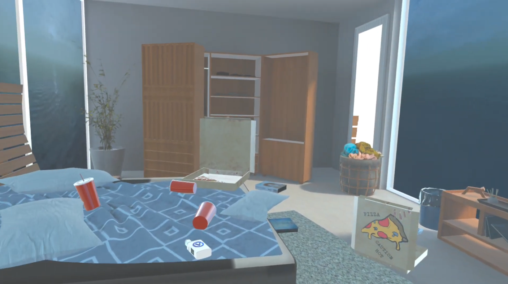
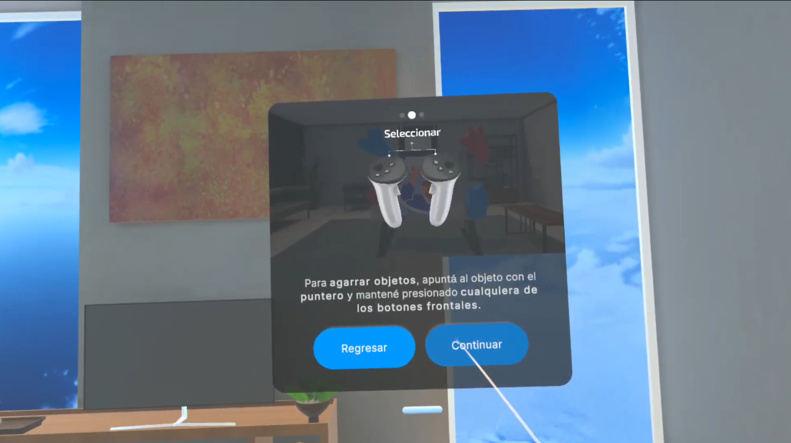
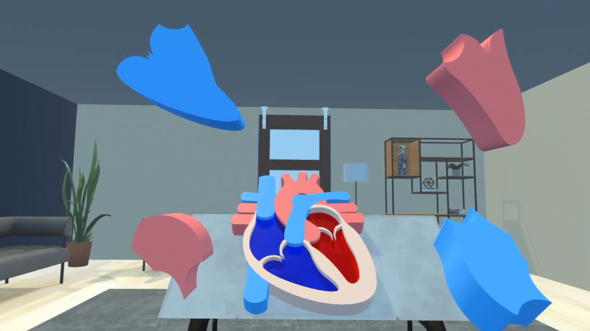
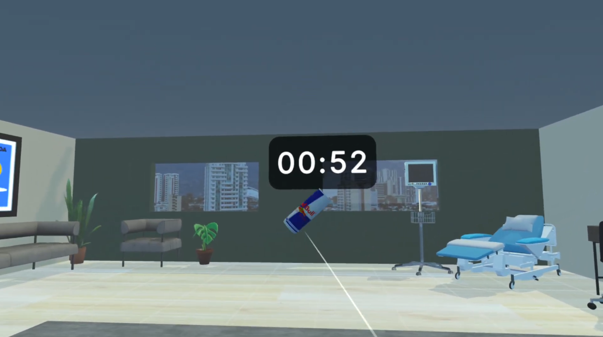
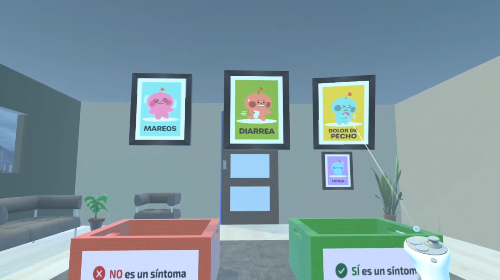
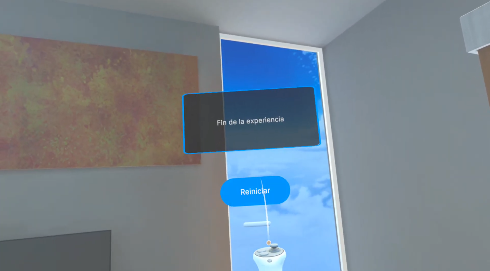

# 💓 Las señales del corazón — Experiencia VR

  

Una experiencia de realidad virtual educativa e inmersiva diseñada para concientizar a los usuarios sobre las arritmias cardíacas, sus causas y sus síntomas, a través de una narrativa guiada y tres minijuegos interactivos.

---

## 📖 Descripción General

El usuario inicia en un entorno de descanso tranquilo que progresivamente se transforma en algo perturbador, representando el impacto de los malos hábitos en la salud cardiovascular. Una voz interior guía al usuario a través de la experiencia, llevándolo a comprender qué es una arritmia, qué hábitos la provocan y cómo reconocer sus síntomas.

La experiencia combina narración ambiental, diseño de sonido reactivo y mecánicas de juego hands-on para generar aprendizaje activo y emocional.

---

## 🛠️ Stack Técnico

| Componente | Detalle |
|-----------|---------|
| Motor | Unity 6.3 LTS |
| Template | VR Core |
| Plataforma objetivo | Meta Quest |
| Build target | Android (APK) |
| Input / Interacción | XR Interaction Toolkit |
| Simulación en PC | XR Device Simulator |

---

## 📸 Capturas de la Experiencia

### Bienvenida — Habitación de Descanso


### Tutorial de Controles


### Minijuego 1 — Estabilizá tu Corazón


### Minijuego 2 — Agarrá Buenos Hábitos


### Minijuego 3 — Cuarto de los Síntomas


### Cierre


---

## 🗺️ Flujo de la Experiencia

```
Bienvenida (Habitación de descanso)
        ↓
  Tutorial de Controles
        ↓
  Portal → Minijuego 1
  [Estabilizá tu Corazón — Arritmias]
        ↓
  Portal → Minijuego 2
  [Agarrá Buenos Hábitos — Causas]
        ↓
  Portal → Minijuego 3
  [Cuarto de los Síntomas — Síntomas]
        ↓
     Cierre
  (Regreso a la habitación)
```

---

## 🎮 Controles

| Acción | Control |
|--------|---------|
| Girar cámara | Mover físicamente la cabeza |
| Seleccionar / Agarrar objetos | Botones frontales (cualquier control) |
| Navegar menús | Botones frontales |

---

## 🧩 Resumen de Minijuegos

| # | Nombre | Tema | Duración | Mecánica principal |
|---|--------|------|----------|--------------------|
| 1 | Estabilizá tu Corazón | Arritmias | Sin límite | Puzzle de piezas |
| 2 | Agarrá Buenos Hábitos | Causas / Hábitos | 1 minuto | Clasificación por agarre |
| 3 | Cuarto de los Síntomas | Síntomas | Sin límite | Clasificación de cuadros |

---

## 📄 Licencias y Créditos de Assets
Los modelos 3D, texturas y assets de terceros utilizados en esta experiencia están documentados en [`docs/CREDITS.md`](docs/CREDITS.md).

---
## 👥 Equipo


| Rol | Nombre |
|-----|--------|
| Diseño de experiencia |Laura Benavides Gamboa, Amanda Coto Robles, Melina Gálvez Navarro |
| Programación VR |Susana Feng Liu, Ximena Molina Portilla |

---